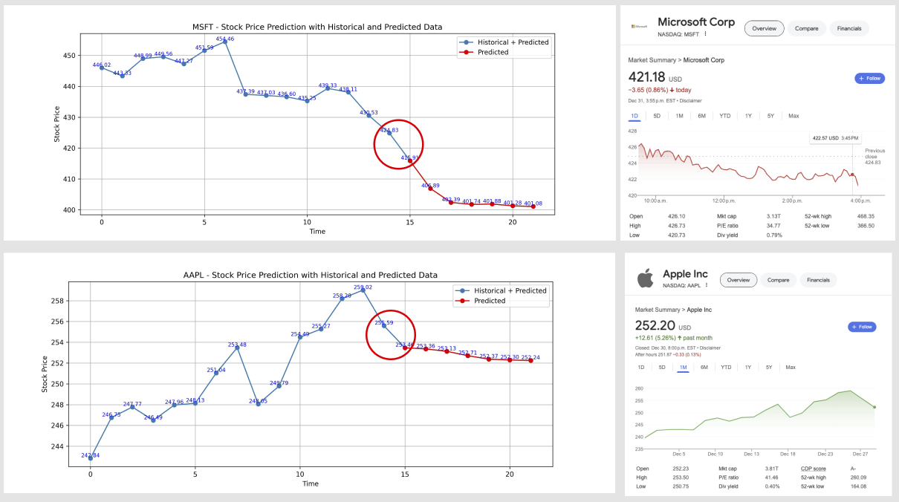

<strong>Technical README: Flask-Based Stock Prediction App</strong>

This project demonstrates the implementation of an end-to-end pipeline for stock prediction using Flask. It incorporates a web interface for user input, model training, and prediction processes, all integrated into Flask routes.

<strong>Project Objectives:</strong>

<ul>
    <li>Build a Flask-based web application with two primary routes.</li>
    <li>Train and optimize an LSTM model for stock price prediction.</li>
    <li>Perform next-day and 7-day stock price predictions based on historical data.</li>
    <li>Save the trained model and plot the predictions.</li>
    <li>Serve the predictions and visualization via Flask routes.</li>
</ul>

<strong>Flask Routes:</strong>

<ul>
    <li><code>/</code>: 
        
A route that serves a form to accept the stock symbol from the user. The stock symbol is passed as a query parameter to the prediction route.

    </li>
    <li><code>/stock_prediction</code>: 
        
A route that performs the following:

        <ul>
            <li>Loads or trains an LSTM model for the given stock symbol using historical data fetched via Yahoo Finance.</li>
            <li>Optimized model architecture consists of multiple LSTM layers with specific dropout values and dense layers for the final output.</li>
            <li>Predicts both next-day and 7-day stock prices with a model accuracy of 92%.</li>
            <li>Plots the predictions along with historical stock prices using Matplotlib and saves the plot in the <code>static/stock_graphs/</code> directory.</li>
            <li>Saves the trained model in the <code>stock_models/</code> directory for reuse.</li>
            <li>Returns the predictions and the plot as part of the response.</li>
        </ul>
    </li>
</ul>

<strong>LSTM Model Details:</strong>

<ul>
    <li><strong>Architecture:</strong> A Sequential model with the following structure:
        <ul>
            <li>5 LSTM layers, each with decreasing neuron counts: 100, 50, 20, 10, and 5.</li>
            <li>Dropout values for regularization: 0.1 for the initial layers, 0.0 for the final layers.</li>
            <li>Final Dense layer with a single output neuron for the stock price.</li>
        </ul>
    </li>
    <li><strong>Optimizer:</strong> The model uses an optimizer with parameters tuned for best performance.</li>
    <li><strong>Data Scaling:</strong> Data is scaled using <code>StandardScaler</code> for consistent model input and output ranges.</li>
    <li><strong>Evaluation:</strong> Achieved an accuracy of 92% during training and validation.</li>
</ul>

<strong>Process Workflow:</strong>

<ol>
    <li>User inputs the stock symbol on the <code>/</code> route form.</li>
    <li>The <code>/stock_prediction</code> route fetches historical stock data for the given symbol using Yahoo Finance.</li>
    <li>Data is preprocessed, split into training and test sets, and scaled using <code>StandardScaler</code>.</li>
    <li>An LSTM model is trained on the data if no pre-trained model exists. The trained model is saved for future predictions.</li>
    <li>The next-day and 7-day stock price predictions are generated.</li>
    <li>A plot is created showing historical data and predicted values, saved in the <code>static/stock_graphs/</code> directory, and served via Flask.</li>
</ol>

<strong>Output Details:</strong>

<ul>
    <li><strong>Predictions:</strong> 
        <ul>
            <li>Next day's stock price: A single float value.</li>
            <li>7-day forecast: A list of 7 float values representing predicted stock prices.</li>
        </ul>
    </li>
    <li><strong>Plot:</strong> The prediction plot includes historical data and the 7-day forecast, with annotated points for clarity.</li>
    <li><strong>Model Path:</strong> Saved in <code>stock_models/</code> as <code>{stock_symbol}.h5</code>.</li>
    <li><strong>Plot Path:</strong> Saved in <code>static/stock_graphs/</code> as <code>stock_prediction_plot.jpg</code>.</li>
</ul>

<strong>Key Technical Features:</strong>

<ul>
    <li>Dynamic routes using Flask for efficient user interaction and prediction delivery.</li>
    <li>Optimized LSTM architecture for time-series forecasting.</li>
    <li>Integration with Yahoo Finance for real-time stock data fetching.</li>
    <li>Matplotlib visualization saved and served via Flask's static file handling.</li>
    <li>End-to-end process encapsulated within Python classes and Flask routes for modularity and scalability.</li>
</ul>

<strong>Example Usage:</strong>

<code>
python stock_app.py
</code>

Access the application at <code>http://127.0.0.1:5000/</code>.

<strong>Dependencies:</strong>

<ul>
    <li>Flask</li>
    <li>Keras</li>
    <li>TensorFlow</li>
    <li>Pandas</li>
    <li>NumPy</li>
    <li>Yahoo Finance API (<code>yfinance</code>)</li>
    <li>Matplotlib</li>
</ul>

<strong>Note:</strong> Ensure the directory structure includes <code>static/</code> and <code>stock_models/</code> folders at the same level as <code>app.py</code>.

<h2> Prediction Results </h2>

